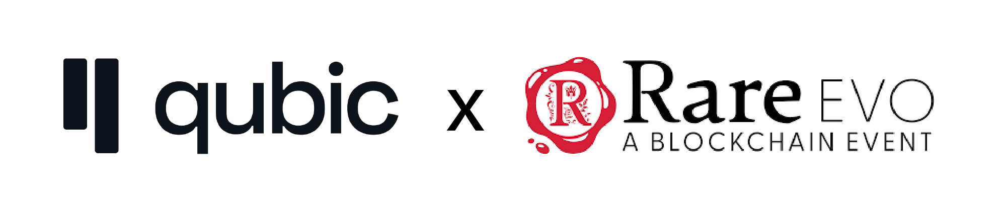
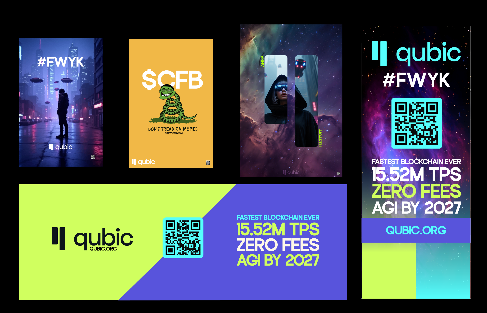

# Proposal for QUBIC Booth at RareEvo Conference, Las Vegas

**Event Details**: RareEvo Conference, Las Vegas, August 6-10, 2025 (3 weeks from July 16, 2025)  
**Funding Requested**: 50 million QUBIC tokens (estimated value: SPOT, based on current market price) + $16,019.07 USD  
**Recipient Wallet Address**: QTTMHKZFRUYFNCFRZUMMFOETWVSAVGICTYVXAAASDFMCBKNVCLZXACWEEHDM

## Summary
This proposal outlines QUBIC’s participation at the RareEvo Conference in Las Vegas, occurring in 3 weeks (August 6-10, 2025), to enhance brand visibility, promote the Qubic Tickchain, showcase Quottery as a smart contract application, and highlight QCap. The plan includes a 10x10 booth, high-quality printed materials, branded merchandise, a 50 million QUBIC token giveaway, and a team of up to 3 members. The total estimated cost is $16,019.07 USD, with a 10% contingency for budget items, plus 50 million QUBIC tokens. We aim to engage the crypto community, forge strategic partnerships, and drive adoption through interactive initiatives. Given the tight timeline, with community approval potentially taking 1 week, we request expedited voting on [insert community platform link] to meet event deadlines and advance QUBIC’s ecosystem goals.

## Rationale
The RareEvo Conference, held August 6-10, 2025, is a premier blockchain event, attracting over 10,000 developers, investors, and enthusiasts, making it a critical platform to showcase QUBIC’s innovative blockchain technology, particularly the Qubic Tickchain. The event’s audience aligns with QUBIC’s target market, and its timing necessitates urgent approval (within 1 week) to secure logistics and materials. Participating in 2025 offers a timely opportunity to leverage early-bird rates for booth space and accommodations, ensuring cost efficiency. QUBIC’s presence will differentiate it from competitors by emphasizing its unique Tickchain technology, Quottery’s smart contract capabilities, and QCap’s value proposition, positioning QUBIC as a leader in the blockchain space.

## Proposal Details
### Funding Options

- **Premium Presence (Recommended)**: 10x10 booth, 50 million QUBIC token giveaway, high-quality printed materials, branded T-shirts, and a team of 3 for maximum networking. Total cost: $16,019.07 USD + 50 million QUBIC.
- **Basic Presence**: 10x10 booth, reduced printed materials (25 11x17 posters, 1 banner), no T-shirts, 25 million QUBIC giveaway, 2 team members. Estimated cost: $9,500 USD + 25 million QUBIC.
The premium option maximizes visibility, engagement, and networking opportunities, leveraging the full team and giveaway to attract high-value connections like Charles Hoskinson (IOHK) and Veronica Hash (Coinbase).

### Cost Breakdown
| Item | Cost (USD) |
|------|------------|
| 50ct 11x17 Posters | $71.82 |
| 10ct 24x36 Posters | $424.00 |
| 2ct Vinyl Banners (Portrait) | $136.57 |
| 2ct Tension Fabric Banners | $733.00 |
| 1ct 3x6 Vinyl Banner (Landscape) | $86.19 |
| 36ct T-Shirts | $862.49 |
| 10x10 Booth (includes 1 VIP pass, 2 exhibitor tickets) | $5,500.00 |
| Airfare (3 team members, round-trip, 10% contingency) | $935.00 |
| Accommodation (Caesars Palace, 3 rooms, 5 nights, 10% contingency) | $4,950.00 |
| Per Diem ($88/day, 3 people, 5 days, 10% contingency) | $1,320.00 |
| VIP Upgrades (2 exhibitor tickets to VIP, $500 each) | $1,000.00 |
| 50 million QUBIC Giveaway | SPOT |
| **Total** | **$16,019.07 + 50M QUBIC** |

### Cost-Saving Measures
- Early booking for Caesars Palace to secure $300/night rate, critical with only 3 weeks until the event.
- Sourcing printed materials from Prima Graphics with confirmed pricing to minimize contingency use.
- Upgrading exhibitor tickets to VIP passes ($500 each) to enhance networking without additional booth costs.

## Goals & KPIs
| Goal | Target | KPI |
|------|--------|-----|
| Brand Visibility | Engage 1,000+ attendees | Booth visits tracked via QR code scans |
| Wallet Registrations | minimum of 50 new QUBIC wallets | Number of wallets registered via giveaway |
| Networking | Connect with 5+ key industry figures | Meetings with figures like Charles Hoskinson, Veronica Hash, etc. |
| Social Media Growth | 500+ new followers | Track mentions and followers on platforms like X |
| Event Invitations | Aim to Secure future event invites | Documented invitations received |
| CEX Relationships | Engage 1 or more US CEX representatives | Follow-up meetings scheduled post-event |
| Visual Content | 50+ photos/videos | Content posted on QUBIC’s social channels |

These goals align with QUBIC’s objectives of ecosystem growth, stakeholder engagement, and technology adoption.

## Execution Plan
### Pre-Event (3 Weeks Remaining)
- **Design Materials**: Finalize posters, banners, and T-shirt designs within 5 days to meet the 7-day turnaround for tension fabric banners, emphasizing Qubic Tickchain, Quottery, and QCap.
- **Logistics**: Book flights and accommodations within 3 days of approval (assuming 1-week voting) to secure rates. Confirm T-shirt and printing costs with Prima Graphics immediately.
- **Giveaway Setup**: Develop QR code-based wallet registration for secure 50 million QUBIC token distribution, potentially using Quottery for a raffle. Create NFTs as raffle tickets and memorabilia within 10 days.

### During Event (August 6-10, 2025)
- **Booth Activities**: Deliver Qubic Tickchain pitch, showcasing Quottery and QCap. Distribute 36 T-shirts to high-value attendees and use posters/banners for visibility.
- **Engagement**: Run 50 million QUBIC giveaway via QR code scans or on-site tasks, using NFTs as raffle tickets.
- **Networking**: Leverage VIP passes for team to attend exclusive sessions, targeting connections with Charles Hoskinson, Veronica Hash, Austin Arnold, and others.
- **Content Creation**: Capture photos/videos for social media to highlight booth activity and interactions.

### Post-Event
- **Follow-Up**: Schedule meetings with new contacts, particularly US CEX representatives, within 2 weeks.
- **Report**: Publish a post-event report on [insert community platform] detailing outcomes, KPI results, and content within 10 days.
- **Social Media**: Share visual content on X and other platforms to sustain engagement.

## Execution Team
- **Lead Proposer**: Evandon (aka Nineisten)
- **Team Members**: NFT_Ronnie and 1 additional QUBIC representative for booth setup, networking, and presentations.
- **Roles**: Booth management, Qubic Tickchain pitch delivery, giveaway coordination, content creation for social media.

## Community Engagement
Given the event’s proximity (3 weeks from July 16, 2025) and possible 1-week approval timeline, we urge expedited community feedback and voting. Options include:
- **Approve**: Fund $16,019.07 USD + 50 million QUBIC for premium presence.
- **Reject**: Provide feedback for revisions.
This proposal advances QUBIC’s mission to drive blockchain innovation and adoption. Join us in making RareEvo a milestone for QUBIC’s growth!

## Recommendations
1. **Confirm Supplier Costs**: Verify T-shirt and printing costs with Prima Graphics within 2 days of approval to meet deadlines.
2. **Book Early**: Secure Caesars Palace reservations immediately upon approval to lock in $300/night rate.
3. **Giveaway Logistics**: Finalize QR code or Quottery-based raffle system within 5 days for secure token distribution.
4. **Design Alignment**: Ensure all materials highlight Qubic Tickchain, Quottery, and QCap, with designs completed within 5 days to meet the possible 7-day printing turnaround.

## Conclusion
QUBIC’s participation at RareEvo (August 6-10, 2025) will establish it as a blockchain innovator, emphasizing the Qubic Tickchain, Quottery, and QCap. With a budget of $16,019.07 USD, 50 million QUBIC tokens, and a lean team of 3, QUBIC will maximize visibility, engagement, and networking. Given the 3-week timeline and 1-week approval process, we urge the community to vote for approval on [insert platform link] to support this strategic opportunity.